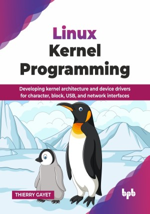

# Linux Kernel Programming

Developing kernel architecture and device drivers for character, block, USB, and network interfaces.

This is the repository for [Linux Kernel Programming
](https://bpbonline.com/products/linux-kernel-programming?_pos=1&_sid=264b66bcf&_ss=r&variant=44667943878856),published by BPB Publications.

## About the Book
Linus Torvald released the first version of a kernel in 1991, inspired at the time by both proprietary Unix and the Minix system. Thirty-four years later, this system has evolved with stability and robustness, making it almost indispensable for the DevSecOps community. The Linux kernel forms the robust core of countless systems, from embedded devices to vast data centers, driving unparalleled power and flexibility. This book is your essential guide to deeply understanding this fundamental component and mastering the art of developing high-performance kernel-level code

This book meticulously details the kernel's history, architectural evolution, and custom build processes. You will master device driver fundamentals, distinguishing user from kernel space, and understanding the Linux Device Model (LDM). It explores Linux Security Modules, intricate kernel memory management, and various vital communication interfaces like I2C, SPI, SERIAL, PCI, and RTC. The guide concludes with task/process management, real-time concepts, and essential kernel debugging and profiling.

By the end of this book, you will be well-equipped to confidently develop, optimize, and debug kernel-level code. This empowers you to build custom Linux systems, craft efficient device drivers, and troubleshoot complex issues, ready to tackle advanced Linux system programming challenges. You will also be able to better understand this system and develop your own drivers or low-level developments for it.

## What You Will Learn
• GNU/Linux kernel history, feature evolution, and licensing.

• Understand and develop your character and block drivers.

• Develop new file systems.

• Manage your systems by communicating with the USB protocol.

• Debug your drivers, your kernel, or any other module in the kernel space.

• Understand the layout of the Linux device model.

• Memory management in the kernel, as well as via DMA or NUMA.

• Implement Linux Security Modules (LSM) and Netfilter stack hooks.
